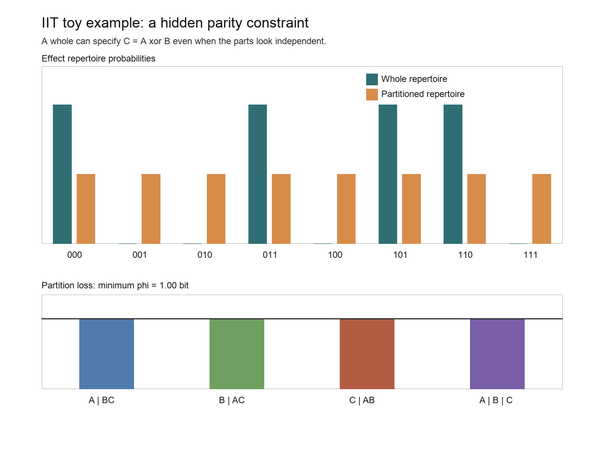

# Homework 3: IIT Parity Example

This folder contains a small executable Python program for the report assignment on Integrated Information Theory (IIT).

## Idea

The lecture notes introduced photodiodes, digital cameras, a two-unit integrated pair, exclusion with an added noisy unit, and recurrent/feedforward networks.  This program uses a different toy example: three binary units whose next state must satisfy a parity rule

```text
C = A xor B
```

The interesting point is that each single unit still looks like a fair coin.  Even each pair of units looks unconstrained.  However, the whole three-unit system rules out half of the possible future states.  In a simplified IIT-style calculation, cutting the system destroys this whole-system relation.

The script computes

```text
phi = D_KL(whole effect repertoire || partitioned effect repertoire)
```

for several partitions and plots the result.



## Files

- `environment.yml`: Conda environment for running the program.
- `iit_parity_example.py`: Executable Python script that creates the plot.
- `iit_parity_example.png`: Generated after running the script.

## How to Run

Create and activate the environment:

```bash
conda env create -f environment.yml
conda activate iit-homework3
```

Run the program:

```bash
./iit_parity_example.py
```

If the executable bit is lost after downloading, run:

```bash
chmod +x iit_parity_example.py
./iit_parity_example.py
```

The program saves the figure as `iit_parity_example.png` and also opens the plot window.

## Result

The orange bars show what the distribution looks like after a partition cut: all eight future states are equally likely.  The green bars show the whole-system repertoire: only the four states satisfying the XOR parity relation are possible.

Because the partitioned system cannot represent the parity relation, the KL divergence is positive.  In this toy model the minimum partition still loses `1.00 bit` of information, so the simplified integrated information is

```text
phi = 1.00 bit
```
