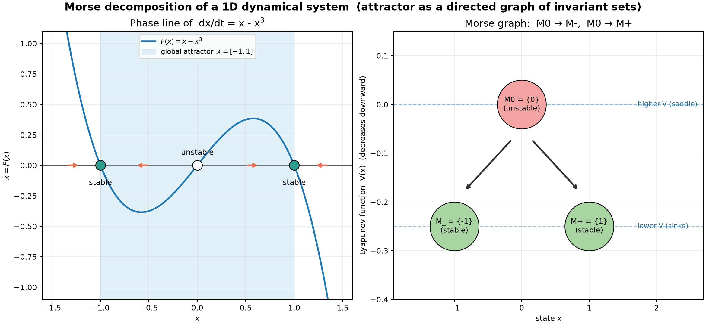

# Homework 5: 1 次元力学系の Morse 分解

このフォルダには、講義ノート（Lecture 5）の最終課題として作成した、実行可能な
Python プログラムを置いています。課題の選択肢のうち、

1. **1 次元力学系の Morse 分解**
2. **不変集合の有向グラフとして表現したアトラクター**

の 2 つを 1 枚の図で同時に示しています。

## 例の概要

講義ノートの Example 2.1 / Example 3.1 と同じ 1 次元自励系を扱います。

```text
dx/dt = F(x) = x - x^3 = -V'(x),   V(x) = -x^2/2 + x^4/4
```

平衡点は `x = -1, 0, 1` の 3 点です。`F'(x) = 1 - 3x^2` より

- `F'(-1) = F'(1) = -2 < 0` → **安定**（沈点 / sink）
- `F'(0) = 1 > 0` → **不安定**（saddle 相当）

となります。有界な初期値はすべて `[-1, 1]` に引き込まれるので、**大域アトラクター**は

```text
A = [-1, 1]
```

です。この `A` の内部組織を粗く記述するのが **Morse 分解**で、この系では

```text
M0 = {0}   (不安定),   M_ = {-1} (安定),   M+ = {1} (安定)
```

の 3 つの Morse 集合に分かれます。接続軌道（connecting orbit）は

```text
M0 --> M_ ,   M0 --> M+
```

の 2 本で、不安定な現在状態 `{0}` が 2 つの可能な未来（`-1` と `1`）を持つことを
表します（講義ノート Figure 8 に対応）。



## 図の見方

- **左（位相線図 / phase line）**
  - 青い曲線が `F(x) = x - x^3`。曲線が 0 と交わる点が平衡点です。
  - 塗りつぶしの丸が安定平衡点、白抜きの丸が不安定平衡点です。
  - オレンジの矢印は相線上の流れの向き（`F > 0` なら右、`F < 0` なら左）で、
    `0` から離れて `±1` へ向かうこと（= 接続軌道）が読み取れます。
  - 水色の網掛けが大域アトラクター `A = [-1, 1]` です。
- **右（Morse グラフ）**
  - ノードが Morse 集合、矢印が接続軌道です。アトラクターを
    「不変集合を頂点とする有向グラフ」として表現しています。
  - 縦位置は Lyapunov 関数 `V(x)` の値で、**下ほど V が小さい**＝より安定です。
    `V(0) = 0`（上）、`V(±1) = -1/4`（下）なので、矢印はすべて上から下（V が
    減少する向き）に向きます。これは講義ノート Figure 7 の
    「recurrent pieces plus downhill motion between them」を実装したものです。

## Morse 分解・統合情報との関係

Morse 分解は、大域アトラクターを **「再帰的なかたまり（Morse 集合）＋
それらをつなぐ downhill な接続軌道」** に分解したものです。`V(x)` は各 Morse
集合上で一定・軌道に沿って単調非増加の **Lyapunov 関数**であり、Morse グラフの
矢印の向きを与える半順序（`M0 ≻ M±`）を実現します。

さらに講義ノート第 4〜6 章によれば、この Morse グラフはそのまま**情報構造
（informational structure）**の骨格になります。すなわち Morse 集合を「不変な
活動パターン（ノード）」、接続軌道を「あるパターンから別のパターンへ移りうる
可能性（有向辺）」とみなすと、連続時間版の状態遷移構造が得られます。この系では

- 現在状態が `{0}`（不安定）なら、未来として `{-1}` と `{1}` の両方が可能、
- 現在状態が `{-1}` または `{1}`（安定）なら、そこに留まる、

という **effect repertoire（可能な未来）** が Morse グラフの矢印から直接読めます。
つまり本図は、幾何的な力学（相空間の流れ）を IIT 的な因果構造（可能な過去・未来の
レパートリー）へ変換する最初の一歩を、最も単純な 1 次元系で具体化したものです。

## ファイル

- `environment.yml`: プログラムを実行するための Conda 環境ファイルです。
- `morse_decomposition.py`: 図を生成する実行可能な Python スクリプトです。
- `morse_decomposition.png`: スクリプトを実行すると生成される図です。

## 実行方法

`homework5/` をカレントディレクトリとして、以下を実行します。

```bash
conda env create -f environment.yml
conda activate morse-homework5
python morse_decomposition.py
```

実行するとプロット画面が表示され、同時に `morse_decomposition.png` が保存されます。
画面表示のできない環境では、次のように非対話バックエンドを指定してください。

```bash
MPLBACKEND=Agg python morse_decomposition.py
```
