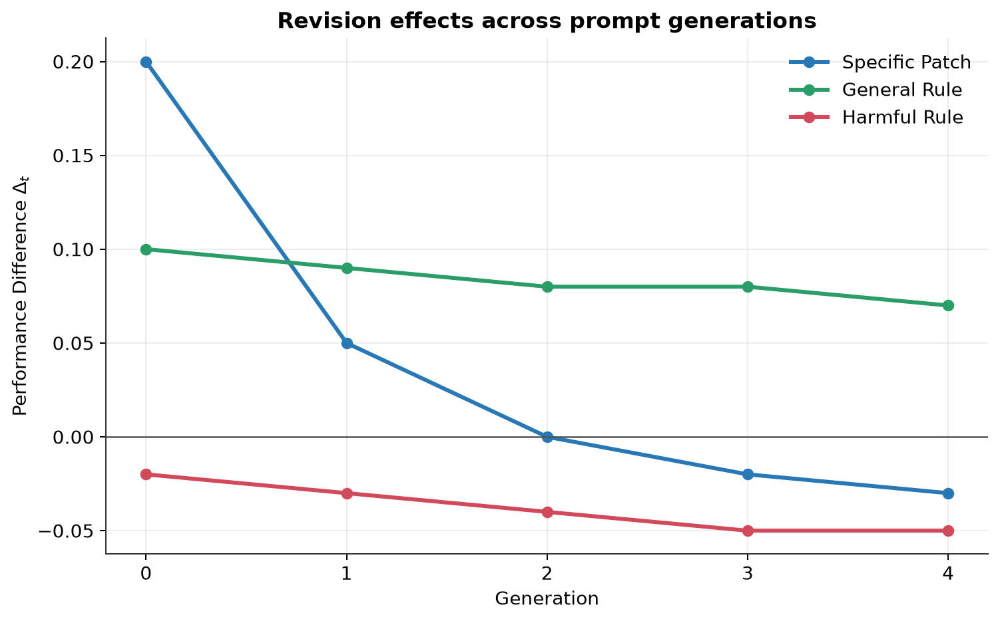
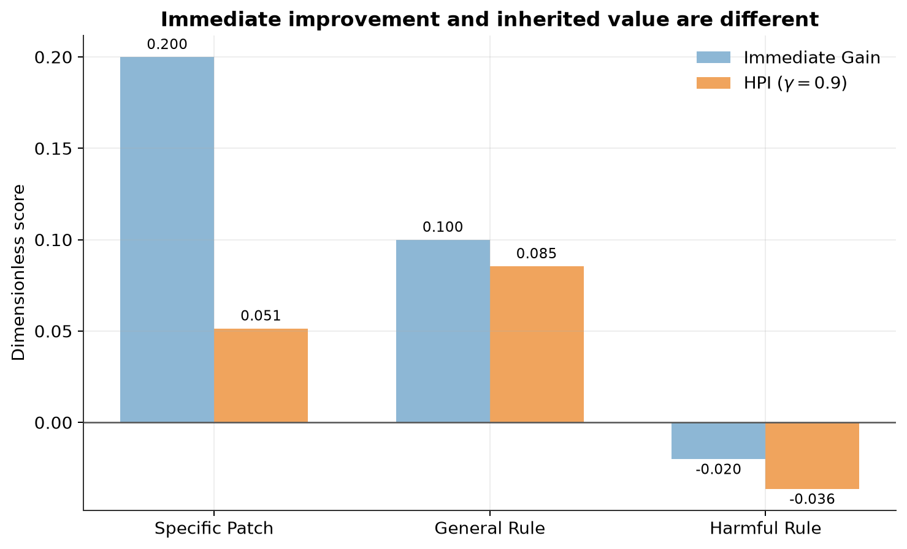
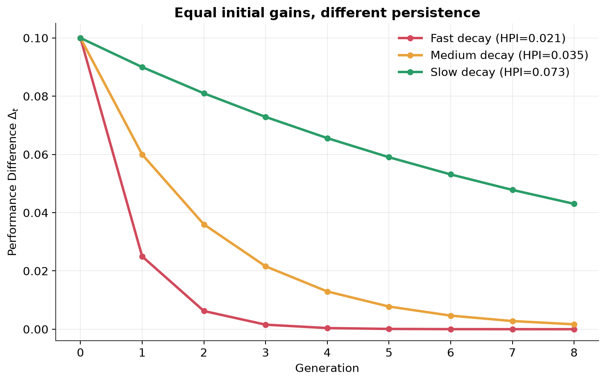
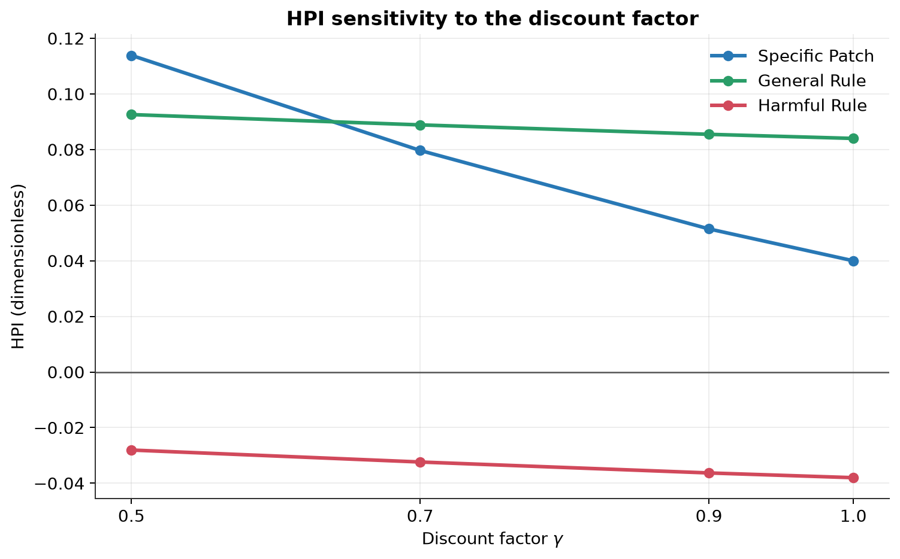

# Heritable Prompt Information

## 概要

本課題では、自動プロンプト最適化における新しい情報量として **Heritable Prompt Information（HPI）** を提案する。
従来の自動プロンプト最適化では、候補プロンプトの良し悪しを、その時点におけるタスク性能によって評価することが多い。

しかし、現在の評価データに対して大きな性能改善をもたらす修正と、その後のプロンプト探索でも繰り返し有効となる修正は必ずしも同じではない。

そこで本課題では、自動プロンプト最適化における情報を次のように考える。
> **自動プロンプト最適化における情報とは、有益なプロンプト修正が、その後の探索過程へ継承される程度である。**

この考えに基づき、プロンプト修正の効果が将来の世代へどの程度残るかを表す情報量としてHPIを定義する。

HPIはShannon情報量の一般化ではなく、自動プロンプト最適化のために「情報」という概念を操作的に定義したタスク固有の無次元スコアである。
したがって、HPIの単位はbitではない。


## モチベーション
例えば、あるプロンプト最適化の途中で、次の2種類の修正候補が得られたとする。

### Specific Patch
```text
If the input contains this particular pattern, answer using rule A instead of rule B.
```
ある修正により、このプロンプトが得られたとする。
しかし、修正は現在の評価データに含まれる特定の失敗例には非常によく適合しており、修正直後の性能を大きく改善するとする。

しかし、このルールは特定の例に強く依存しているため、その後にmutationなどによってプロンプトが変化すると効果が急速に失われる可能性がある。
例えば、世代ごとの性能改善が次のようになったとする。
```text
Specific Patch:
[0.20, 0.05, 0.00, -0.02, -0.03]
```
修正直後には `+0.20` という大きな改善が得られている。
一方で、その後の世代では効果が急速に消失している。

### General Rule
別の修正として、次のような一般的なルールが得られたとする。
```text
Before producing the final answer, check all constraints specified in the instruction.
```
この修正による直後の性能改善は `+0.10` であり、Specific Patchの `+0.20` より小さいとする。

しかし、このルールは特定の例だけに依存していないため、その後にプロンプトが変化しても有効であり続ける可能性がある。
例えば、世代ごとの性能改善が次のようになったとする。
```text
General Rule:
[0.10, 0.09, 0.08, 0.08, 0.07]
```
修正直後だけを評価すれば、Specific Patchの方が優れている。
しかし、その後の探索まで考えると、General Ruleの方が長期間にわたって有益な影響を残している。

本課題では、この違いを「情報の継承性」として捉える。
すなわち、現在のプロンプトを改善するだけの修正よりも、後続するプロンプト探索にも有益な性質を残す修正の方が、多くの情報を持つと考える。

## 自動プロンプト最適化とは
自動プロンプト最適化とは、大規模言語モデル（Large Language Models; LLMs）の性能を引き出すことを目的として、プロンプトを自動的に探索・改善する手法である$^{[1-7]}$。

近年では、GPT系列$^{[8]}$やClaude系列$^{[9]}$に代表されるように、モデルの重みが公開されていないブラックボックス型のLLMも高い性能を示している。
このようなモデルでは、モデル内部の勾配を直接利用したプロンプト最適化が困難である。
そこで、LLM自身による内省（フィードバック）$^{[1-4]}$や、LLMを遺伝オペレータとして活用することによる交叉や突然変異などの進化アルゴリズム$^{[5-7]}$などを利用して、自然言語としてプロンプトを改善する方法が研究されている。

これらの方法では、ある世代で得られた修正が、その後に生成されるプロンプトへ影響を与える。
そのため、修正直後の性能だけでなく、その修正の有益な性質が後続の探索へどれだけ残るかを評価することには意味があると考える。

## 情報量の定義

世代 $t$ における修正 $r$ の効果を次のように定義する。

$$
\Delta_t(r)=S(P_t^{+r})-S(P_t^{-r})
$$

ここで、各記号は次を表す。

- $P_t^{+r}$: 修正 $r$ を導入した系列の世代 $t$ のプロンプト
- $P_t^{-r}$: 修正 $r$ を導入しなかった対照系列の世代 $t$ のプロンプト
- $S(P)$: プロンプト $P$ のタスク性能
- $t=0$: 修正直後
- $t>0$: mutationやevolutionなどを経た後の世代

$\Delta_t(r)>0$ であれば、修正 $r$ の有益な効果が世代 $t$ においても残っていることを表す。

$\Delta_t(r)=0$ であれば、修正を導入した系列と導入しなかった系列に性能差がないことを表す。

$\Delta_t(r)<0$ であれば、修正を導入したことが、その世代では逆に性能を悪化させていることを表す。

ここで、$\Delta_t(r)$ 自体は情報量ではなく、世代 $t$ に残っている修正の効果を表す量である。

## HPIの定式化

最終的に観測する世代を $T$、将来世代に対する割引率を $\gamma\in(0,1]$ とする。

Heritable Prompt Information（HPI）を次のように定義する。

$$
I_{\mathrm{HPI}}(r)=\frac{\sum_{t=0}^{T}\gamma^t\Delta_t(r)}{\sum_{t=0}^{T}\gamma^t}
$$

この式は、各世代に残っている修正の効果 $\Delta_t(r)$ を、世代方向に加重平均したものである。

$\gamma$ が小さい場合、修正直後の効果を強く評価する。

$\gamma$ が1に近い場合、遠い世代に残る効果も強く評価する。

例えば $\gamma=1$ の場合、HPIは単純な世代平均となる。

$$
I_{\mathrm{HPI}}(r)=\frac{\Delta_0(r)+\Delta_1(r)+\cdots+\Delta_T(r)}{T+1}
$$

例えば、Specific Patchについて、世代ごとの性能差が次のようになったとする。

$$
\Delta=[0.20,\ 0.05,\ 0.00,\ -0.02,\ -0.03]
$$

$\gamma=1$ とすると、HPIは次のようになる。

$$
I_{\mathrm{HPI}}=\frac{0.20+0.05+0.00-0.02-0.03}{5}=0.04
$$

一方、General Ruleについて、世代ごとの性能差が次のようになったとする。

$$
\Delta=[0.10,\ 0.09,\ 0.08,\ 0.08,\ 0.07]
$$

この場合、HPIは次のようになる。

$$
I_{\mathrm{HPI}}=\frac{0.10+0.09+0.08+0.08+0.07}{5}=0.084
$$

## 期待値について

実際のLLMを用いた自動プロンプト最適化では、mutationやreflectionの結果には確率性がある。
そのため、同じ親プロンプトから最適化を行っても、毎回同じ子プロンプトが生成されるとは限らない。

例えば、修正 $r$ を導入した場合と導入しなかった場合について、それぞれ複数回の探索を行ったとする。
世代 $t$ における各runの性能差が次のようになったとする。
```text
Run 1: 0.82 - 0.75 = 0.07
Run 2: 0.79 - 0.76 = 0.03
Run 3: 0.84 - 0.74 = 0.10
```
この場合、世代 $t$ における平均的な効果は次のように推定できる。
$$
\Delta_t(r)\approx\frac{0.07+0.03+0.10}{3}
$$
一般化すると、次のように表せる。
$$
\Delta_t(r)=\mathbb{E}\left[S(P_t^{+r})-S(P_t^{-r})\right]
$$

期待値は、同じ世代 $t$ において確率的に得られる複数の探索結果を平均するためのものである。
一方、親から子、子から孫という世代方向の効果をまとめているのは、HPIにおける次の部分である。

$$
\sum_{t=0}^{T}\gamma^t\Delta_t(r)
$$

本課題の実験では人工的に与えた決定論的な数値系列を使用するため、実際の計算では期待値を用いない。

## なぜこの情報量を考えるのか
単純な性能改善は次式で表される。
$$
S(p_{\mathrm{new}})-S(p_{\mathrm{old}})
$$

この値は、修正直後の効果しか評価しない。
そのため、現在の評価データだけに過度に適合したSpecific Patchを高く評価する可能性がある。

一方で、より一般的なルールは修正直後の改善が小さくても、その後のmutationや探索でも有効であり続ける可能性がある。
HPIは、修正直後だけではなく、その修正による効果が子孫プロンプトへどの程度残るかを評価する。
これにより、「現在どれだけ改善したか」と「将来の探索へどれだけ有益な変化を残したか」を区別することを目的とする。

## 実験
本実験では外部LLMや有料APIは使用しない。
HPIの基本的な性質を明確に確認するため、プロンプト修正による世代ごとの性能差を人工的な数値系列として与える。
実験1と実験2では、基本設定として $\gamma=0.9$ を使用する。

### Experiment 1: Immediate Gain vs HPI
次の3種類のプロンプト修正を比較する。
```text
Specific Patch: [ 0.20,  0.05,  0.00, -0.02, -0.03]
General Rule:   [ 0.10,  0.09,  0.08,  0.08,  0.07]
Harmful Rule:   [-0.02, -0.03, -0.04, -0.05, -0.05]
```
* Specific Patchは、現在の評価例には大きく効くが、その後の探索では効果が急速に失われる修正を表す。
* General Ruleは、修正直後の改善は比較的小さいが、その後のプロンプトにも有益な影響を残す修正を表す。
* Harmful Ruleは、その後の探索を継続的に悪化させる修正を表す。


Specific Patchは修正直後に大きな改善を示すが、その効果は世代が進むにつれて急速に減少する。
一方、General Ruleは初期改善は小さいものの、その後の世代でも安定して正の効果を維持している。
Harmful Ruleはすべての世代で負の効果を示している。


Immediate GainではSpecific Patchが最も高く評価されるが、HPIではGeneral Ruleが最も高く評価される。
これは、HPIが修正直後の性能だけでなく、その効果が後続世代へどれだけ継承されるかを評価しているためである。

### Experiment 2: Persistence

3系列をすべて $\Delta_0=0.1$ から開始し、効果の持続性だけを変化させる。

世代ごとの性能差を次の式で生成する。

$$
\Delta_t=0.1\rho^t
$$

Fast decayでは $\rho=0.25$ とする。

Medium decayでは $\rho=0.60$ とする。

Slow decayでは $\rho=0.90$ とする。

すべて同じ初期性能改善から開始するため、HPIの違いは主に効果の持続性によって生じる。


すべての系列は同じ初期改善から始まるが、効果が長く持続する系列ほどHPIが大きくなる。
この結果は、HPIが単なる初期性能ではなく、改善の持続性を反映することを示している。

### Experiment 3: Gamma Sensitivity
実験1の3系列について、$\gamma=0.5, 0.7, 0.9, 1.0$ でHPIを計算する。

$\gamma$ が小さい場合は修正直後の性能改善が強く評価される。

$\gamma$ が大きい場合は、将来世代に残る効果がより強く評価される。


$\gamma$ が小さい場合は修正直後の改善が重視されるため、Specific PatchのHPIが高くなる。
一方、$\gamma$ を大きくすると将来世代の効果が重視され、General Ruleがより高く評価される。

## 実行方法
### 手動実行
Condaを使用して実行環境を作成する。

`homework7/` をカレントディレクトリとした状態で以下を実行する。
```bash
conda env create -f environment.yml
conda activate hpi-assignment
python src/main.py
```

### 自動実行
`homework7/` をカレントディレクトリとした状態で以下を実行する。
```bash
./scripts/run.sh
```
実行すると、すべての実験結果がターミナルに表示される。
また、`figures/` に結果の図が保存される。
数値結果は `results/results.csv` に保存される。

## 結果

Experiment 1の結果を以下に示す。

| Revision       | Immediate Gain | HPI ($\gamma=0.9$) |
| -------------- | -------------: | -----------------: |
| Specific Patch |      **0.200** |           0.051461 |
| General Rule   |          0.100 |       **0.085479** |
| Harmful Rule   |         -0.020 |          -0.036301 |

Specific Patchは最も大きな即時性能改善を示した。
一方で、HPIはGeneral Ruleの方が大きくなった。
これは、General Ruleの有益な効果が後続世代にも残っているためである。
Harmful RuleのHPIは負となった。

Experiment 2の結果を以下に示す。

| Persistence  | $\rho$ | Immediate Gain | HPI ($\gamma=0.9$) |
| ------------ | -----: | -------------: | -----------------: |
| Fast decay   |   0.25 |          0.100 |           0.021064 |
| Medium decay |   0.60 |          0.100 |           0.035349 |
| Slow decay   |   0.90 |          0.100 |       **0.073022** |

すべての系列で初期性能改善は0.1である。
それにもかかわらず、効果が長く残る系列ほどHPIが大きくなった。
この結果から、HPIが初期性能改善だけでなく、改善の持続性を反映していることが分かる。

Experiment 3の結果を以下に示す。

| Revision       | $\gamma=0.5$ | $\gamma=0.7$ | $\gamma=0.9$ | $\gamma=1.0$ |
| -------------- | -----------: | -----------: | -----------: | -----------: |
| Specific Patch |     0.113871 |     0.079671 |     0.051461 |     0.040000 |
| General Rule   |     0.092581 |     0.088871 |     0.085479 |     0.084000 |
| Harmful Rule   |    -0.028065 |    -0.032366 |    -0.036301 |    -0.038000 |

$\gamma=0.5$ では現在の大きな改善を持つSpecific Patchが高く評価される。
一方、$\gamma\geq0.7$ では効果を維持するGeneral Ruleが高く評価される。

## 考察
HPIの目的は、単純なperformance gainと、将来の探索へ残る有益な変化を区別することである。
Specific Patchは修正直後には非常に大きな改善を示すが、その効果は後続世代で急速に消失する。
General Ruleは修正直後の改善ではSpecific Patchに劣るが、その効果が後続世代にも残るためHPIでは高く評価される。
この結果は、現在最も高い性能を持つ修正と、将来の探索に最も有益な情報を与える修正が一致しない可能性を示している。

HPIが正である場合、その修正は観測期間全体で平均的に有益な影響を残している。
HPIが0に近い場合、その修正の効果は一時的であり、その後の探索にはほとんど残っていない。
HPIが負である場合、その修正は長期的には探索を悪化させる有害な情報として解釈できる。

GEPA $^{[7]}$ やEvoPrompt $^{[5]}$ のような反復的・進化的な自動プロンプト最適化では、reflection、mutation、crossover、selectionによる修正が次の探索へ影響する。
本実験はGEPAやEvoPromptそのものを再現したものではないが、HPIは、このような最適化過程において、どの修正を将来の探索へ残す価値があるかを分析する指標として利用できる可能性がある。

## 限界

本実験ではHPIの性質を明確に示すことを目的として、人工的な数値系列を使用している。
そのため、実際のLLMによるプロンプト探索そのものを再現した実験ではない。

HPIはタスク性能 $S$、観測期間 $T$、割引率 $\gamma$ に依存する。
異なるタスク間でHPIを直接比較する場合には、性能尺度を正規化する必要がある。

また、実際の自動プロンプト最適化は確率的であるため、実運用では複数のpaired runを実行して各世代の $\Delta_t$ を推定する必要がある。
その場合には、次のように期待値を考えることができる。
$$
\Delta_t(r)=\mathbb{E}\left[S(P_t^{+r})-S(P_t^{-r})\right]
$$
ここでの期待値 $\mathbb{E}$ は、同じ世代において確率的に得られる複数の探索結果に対する平均を表す。

HPIはShannon entropy、mutual information、KL divergenceなどを置き換える一般的な情報量ではない。
HPIは、自動プロンプト最適化における「有益な修正が将来の探索へどれだけ継承されるか」を情報として扱う、タスク固有の情報指標である。

## 参考文献

[1] Reid Pryzant, Dan Iter, Jerry Li, Yin Lee, Chenguang Zhu, and Michael Zeng. Automatic Prompt Optimization with “Gradient Descent” and Beam Search. In Proc. of EMNLP, pp. 7957–7968. Association for Computational Linguistics, 2023.

[2] Mert Yuksekgonul, Federico Bianchi, Joseph Boen, Sheng Liu, Zhi Huang, Carlos Guestrin, and James Zou. TextGrad: Automatic "Differentiation" via Text. arXiv:2406.07496, 2024.

[3] Binwei Yan, Yifei Fu, Mingjian Zhu, Hanting Chen, Mingxuan Yuan, Yunhe Wang, and Hailin Hu. C-MOP: Integrating Momentum and Boundary-Aware Clustering for Enhanced Prompt Evolution, 2026.

[4] Wenhang Shi, Yiren Chen, Shuqing Bian, Xinyi Zhang, Kai Tang, Pengfei Hu, Zhe Zhao, WEI LU, and Xiaoyong Du. No loss, no gain: Gated refinement and adaptive compression for prompt optimization. In Proc. of NeurIPS, 2025.

[5] Qingyan Guo, Rui Wang, Junliang Guo, Bei Li, Kaitao Song, Xu Tan, Guoqing Liu, Jiang Bian, and Yujiu Yang. Connecting Large Language Models with Evolutionary Algorithms Yields Powerful Prompt Optimizers. In Proc. of ICLR, 2024.

[6] Chrisantha Fernando, Dylan Sunil Banarse, Henryk Michalewski, Simon Osindero, and Tim Rocktäschel. Promptbreeder: Self-Referential Self-Improvement via Prompt Evolution. In Proc. of ICML, 2024.

[7] Lakshya A Agrawal, Shangyin Tan, Dilara Soylu, Noah Ziems, Rishi Khare, Krista Opsahl-Ong, Arnav Singhvi, Herumb Shandilya, Michael J Ryan, Meng Jiang, Christopher Potts, Koushik Sen, Alex Dimakis, Ion Stoica, Dan Klein, Matei Zaharia, and Omar Khattab. GEPA: Reflective Prompt Evolution Can Outperform Reinforcement Learning. In Proc. of ICLR, 2026.

[8] OpenAI. OpenAI GPT-5 System Card. arXiv:2601.03267, 2026.

[9] Anthropic. The Claude 3 Model Family: Opus, Sonnet, Haiku, 2024.
